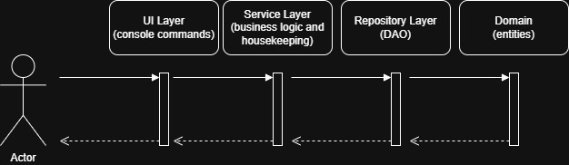

# Описание
CLI приложение для создания коротких ссылок.

Реализованы следующие обязательные требования:
* Алгоритм сокращения и механизма уникальности ссылок для каждого пользователя с использованием 
кодировки Base64URL
* Переход по ссылке из консоли
* Лимит переходов (подсчёт и блокировка) - присутствует как лимит по умолчанию, который берётся из 
конфигурации приложения, так и задаваемый пользователем лимит
* Время жизни и автоудаление по сроку - время жизни ссылок задаётся в конфигурации приложения, 
удаление происходит как отдельным автономным сервисом, а также при попытке перехода по "протухшей"
ссылке
* UUID-идентификация и права на правку/удаление - при запуске приложения генерируется уникальный 
UUID для каждого пользователя. Пользователь может редактировать лимит/URL созданных им ссылок, а 
также удалять активные или "протухшие" ссылки
* Конфигурации приложения из отдельного конфигурационного файла
* Реализован многопользовательский режим и несколько ссылок у одного пользователя, также 
реализована функция логина для переключения между пользователями без перезапуска программы.

Реализованы следующие расширенные требования:
* Уведомления об исчерпании лимита/TTL
* Редактирование лимита и URL (администрирование владельцем)
* Обработка ошибок и устойчивость - валидация команд, их аргументов, а также пользователей
* UX CLI: помощь / подсказки / понятные сообщения - уведомления выводятся в консоль

# Архитектура
В проекте поддержана слоистая архитектура:

Структура проекта:
* config - конфигурация приложения (сканирование бинов)
* domain - сущности и интерфейсы репозиториев для действий над сущностями
* jdbc - реализация интерфейсов репозиториев из domain с использованием Spring JDBC
* service - сервисы, инкапсулирующие логику работы приложения
  * business - сервисы с бизнес-логикой
  * housekeeping - сервисы очистки
  * validation - сервисы валидации ссылок
* ui.console - консольный интерфейс взаимодействия с пользователем
* util - служебные утилиты

# Автоматизация
Настроены проверки билда при создании пулл-реквеста в main:
[build.yaml](.github/workflows/build.yaml)

# Контроль качества
[](https://sonarcloud.io/summary/new_code?id=dfedorino_url-shortener)
[](https://sonarcloud.io/summary/new_code?id=dfedorino_url-shortener)
[](https://sonarcloud.io/summary/new_code?id=dfedorino_url-shortener)

# Запуск
Необходимо для запуска:
* Java 21

Скачать jar файл:
[url-shortener-v1.0.0.jar](https://github.com/dfedorino/url-shortener/releases/download/v1.0.0/url-shortener-1.0.0.jar)
Запустить в терминале в директории, в которую скачан jar:
```
java -jar url-shortener-v1.0.0.jar
```
После этой команды в консоли появится лог и список поддерживаемых комманд:
```
* create : Shorten the given URL, example: 'create https://skillfactory.ru/ 100'
* delete : Delete given link, example: 'delete https://u.rl/AQ'
* edit_limit : Edit active link redirect limit., example: 'edit_limit https://u.rl/AQA https://skillfactory.ru'
* edit_url : Edit active link URL, example: 'edit_url https://u.rl/AQA -url https://skillfactory.ru'
* list : List active created links, example: 'list'
* login : Login with user's UUID, example: 'login 8d365b32-18cb-4c82-bdc5-d9e770a6e7dd'
* quit : Exit, example: 'quit'
* redirect : Redirect with the given short URL to the original URL, example: 'redirect https://u.rl/AQ'
```

Также в директории появится папка .h2. В этой папке содержится файл с базой данных приложения.
При запуске программы создаётся новый пользователь по умолчанию. Сгенерированный UUID отобразится в 
консоли для логина под этим пользователем.

# Примеры команд
Создать ссылку с лимитом переходов по умолчанию
```
create https://skillfactory.ru

Link successfully created!
>> user id: 08daff0b-1f52-4993-8927-8aab7fe471a9
==================================================
>> status: ACTIVE
>> shortened url: https://u.rl/AQ
>> full url: https://skillfactory.ru
>> redirect limit: 1000000
```

Создать ссылку с заданным лимитом
```
create https://skillfactory.ru 1

Link successfully created!
>> user id: 3d4b059b-7b56-41f1-9f9a-31ab0f8e8172
==================================================
>> status: ACTIVE
>> shortened url: https://u.rl/Ag
>> full url: https://skillfactory.ru
>> redirect limit: 1
```
Перейти по ссылке
```
Successfully redirected!

>> user id: 3d4b059b-7b56-41f1-9f9a-31ab0f8e8172
==================================================
>> status: ACTIVE
>> shortened url: https://u.rl/Ag
>> full url: https://skillfactory.ru
>> redirect limit: 0
```
Отредактировать лимит переходов:
```
edit_limit https://u.rl/Ag 10

Redirect limit successfully changed!
>> user id: 3d4b059b-7b56-41f1-9f9a-31ab0f8e8172
==================================================
>> status: ACTIVE
>> shortened url: https://u.rl/Ag
>> full url: https://skillfactory.ru
>> redirect limit: 10
```
Отредактировать полную ссылку:
```
edit_url https://u.rl/Ag https://google.com

URL successfully changed!
>> user id: 3d4b059b-7b56-41f1-9f9a-31ab0f8e8172
==================================================
>> status: ACTIVE
>> shortened url: https://u.rl/Ag
>> full url: https://google.com
>> redirect limit: 10
```
Перечислить активные ссылки:
```
list

Active link successfully fetched!
>> user id: 3d4b059b-7b56-41f1-9f9a-31ab0f8e8172
==================================================
>> status: ACTIVE
>> shortened url: https://u.rl/Ag
>> full url: https://google.com
>> redirect limit: 10
```
Выход из приложения
```
quit
```
Функция смены пользователя. Необходимо снова запустить программу, после чего будет сгенерирован 
новый пользователь. Создадим ссылку под новым пользователем:
```
create https://skillfactory.ru

Link successfully created!
>> user id: f61a51bc-7583-4287-bd3c-3f89c7184e3d
==================================================
>> status: ACTIVE
>> shortened url: https://u.rl/Aw
>> full url: https://skillfactory.ru
>> redirect limit: 1000000
```
Теперь залогинимся с предыдущим пользователем:
```
login 3d4b059b-7b56-41f1-9f9a-31ab0f8e8172

Login successful!
user id: 3d4b059b-7b56-41f1-9f9a-31ab0f8e8172
```
Проверим, что отображаются ссылки только этого пользователя:
```
list

Active link successfully fetched!
>> user id: 3d4b059b-7b56-41f1-9f9a-31ab0f8e8172
==================================================
>> status: ACTIVE
>> shortened url: https://u.rl/Ag
>> full url: https://google.com
>> redirect limit: 10
```
Удаление ссылки:
```
delete https://u.rl/Ag

Link successfully deleted
>> user id: 3d4b059b-7b56-41f1-9f9a-31ab0f8e8172
==================================================
>> status: DELETED
>> shortened url: https://u.rl/Ag
>> full url: https://google.com
>> redirect limit: 10
```